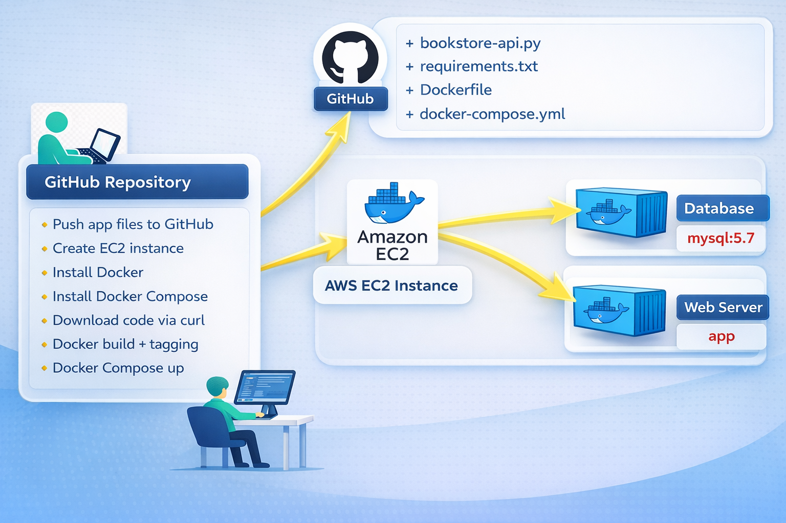
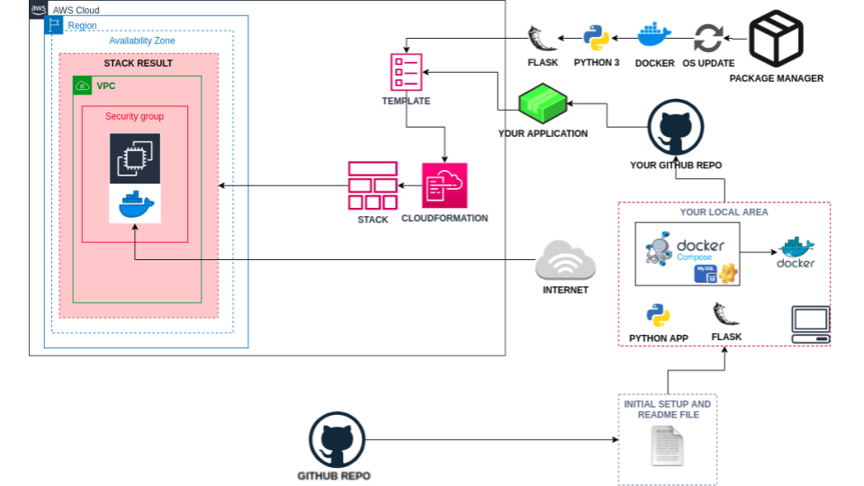

<div align="center">
<H1> 📚 Bookstore Web API 

<br>

**A RESTful API for managing a bookstore, containerized with Docker and deployed on AWS**

[](https://www.python.org/)
[](https://flask.palletsprojects.com/)
[](https://www.docker.com/)
[](https://www.terraform.io/)
[](https://aws.amazon.com/)

</div>

---

## 🎯 Overview

This project demonstrates a production-ready approach to deploying a Python Flask RESTful API using modern DevOps practices. The Bookstore API is containerized with Docker, orchestrated with Docker Compose, and automatically deployed to AWS EC2 using Infrastructure as Code (Terraform).

### Key Features

- 🚀 **RESTful API** - Full CRUD operations for book management
- 🐳 **Dockerized** - Containerized application with Docker Compose
- ☁️ **Cloud Native** - Automated AWS deployment with Terraform
- 🗄️ **MySQL Database** - Persistent data storage
- 🔒 **Secure** - AWS Security Groups configuration
- 📦 **Ready to Deploy** - One-command infrastructure setup

---

## 🏗️ Architecture

<div align="center">



</div>

### Components

```
┌─────────────────────────────────────────────┐
│           AWS EC2 Instance                   │
│  ┌────────────────────────────────────────┐ │
│  │     Docker Compose Environment         │ │
│  │  ┌──────────────┐  ┌───────────────┐  │ │
│  │  │   Flask API  │  │     MySQL     │  │ │
│  │  │   (Port 80)  │◄─┤   Database    │  │ │
│  │  └──────────────┘  └───────────────┘  │ │
│  │           Custom Network                │ │
│  └────────────────────────────────────────┘ │
└─────────────────────────────────────────────┘
```

---

## 📊 Database Schema

| Field       | Type      | Description                        |
|-------------|-----------|-----------------------------------|
| `book_id`   | Integer   | Unique identifier (Primary Key)   |
| `title`     | String    | Book title                        |
| `author`    | String    | Book author                       |
| `is_sold`   | Boolean   | Availability status               |

---

## 🔌 API Endpoints

### Base URL
```
http://[ec2-hostname]/books
```

### Available Operations

| Method   | Endpoint       | Description                    | Example Request                                    |
|----------|----------------|--------------------------------|----------------------------------------------------|
| `GET`    | `/books`       | Retrieve all books             | `curl http://[host]/books`                         |
| `GET`    | `/books/:id`   | Retrieve specific book         | `curl http://[host]/books/123`                     |
| `POST`   | `/books`       | Create new book                | `curl -X POST -H "Content-Type: application/json" -d '{"title":"...","author":"..."}' http://[host]/books` |
| `PUT`    | `/books/:id`   | Update existing book           | `curl -X PUT -H "Content-Type: application/json" -d '{"title":"..."}' http://[host]/books/123` |
| `DELETE` | `/books/:id`   | Delete book                    | `curl -X DELETE http://[host]/books/123`           |

---

## 📁 Project Structure

```
bookstore-project/
│
├── 📄 README.md              # Project documentation
├── 🐍 bookstore-api.py       # Flask application code
├── 📋 requirements.txt       # Python dependencies
│
├── 🐳 Dockerfile             # Container image definition
├── 🔧 docker-compose.yml     # Multi-container orchestration
│
├── ⚙️ main.tf                # Terraform configuration
├── ☁️ cfn-template.yml       # CloudFormation template (optional)
│
└── 📁 img/                   # Project images
    ├── bookstore.png
    └── bookstore-api.png
```

---

## 🚀 Quick Start

### Prerequisites

- [Docker](https://docs.docker.com/get-docker/) & Docker Compose
- [Terraform](https://www.terraform.io/downloads) (v1.0+)
- AWS Account with configured credentials
- Git

### Local Development

```bash
# 1. Clone the repository
git clone https://github.com/your-username/bookstore-api.git
cd bookstore-api

# 2. Build and run with Docker Compose
docker-compose up -d

# 3. Test the API
curl http://localhost/books
```

### AWS Deployment

```bash
# 1. Initialize Terraform
terraform init

# 2. Review the execution plan
terraform plan

# 3. Deploy to AWS
terraform apply -auto-approve

# 4. Get the API URL (from Terraform output)
terraform output api_url
```

---

## 🛠️ Configuration

### Docker Compose Services

```yaml
services:
  web:
    - Port: 80
    - Framework: Flask
    - Dependencies: MySQL
  
  database:
    - Engine: MySQL 8.0
    - Volume: Persistent storage
    - Network: Custom bridge network
```

### AWS Resources

| Resource           | Configuration          |
|--------------------|------------------------|
| **Instance Type**  | t3.micro              |
| **AMI**            | Amazon Linux 2        |
| **Tags**           | Web Server of Bookstore |
| **Security Group** | HTTP (80), SSH (22)   |
| **Region**         | Configurable          |

---

## 📚 Development Guide

### Building the Docker Image

```bash
docker build -t bookstore-api:latest .
```

### Running Tests

```bash
# GET all books
curl -X GET http://localhost/books

# POST new book
curl -X POST http://localhost/books \
  -H "Content-Type: application/json" \
  -d '{"title": "Clean Code", "author": "Robert Martin", "is_sold": false}'

# PUT update book
curl -X PUT http://localhost/books/1 \
  -H "Content-Type: application/json" \
  -d '{"is_sold": true}'

# DELETE book
curl -X DELETE http://localhost/books/1
```

### Environment Variables

Create a `.env` file for local development:

```env
MYSQL_ROOT_PASSWORD=your_password
MYSQL_DATABASE=bookstore_db
MYSQL_USER=bookstore_user
MYSQL_PASSWORD=user_password
```

---

## 🎓 Learning Objectives

By completing this project, you will gain hands-on experience with:

- ✅ **Containerization** - Docker images and multi-container applications
- ✅ **Orchestration** - Docker Compose for service management
- ✅ **Infrastructure as Code** - Terraform for AWS provisioning
- ✅ **Cloud Computing** - AWS EC2, Security Groups, and networking
- ✅ **Database Management** - MySQL configuration and connections
- ✅ **REST API Design** - RESTful web service principles
- ✅ **Bash Scripting** - Automation with user-data scripts
- ✅ **Version Control** - Git and GitHub workflows

---

## 🔒 Security Best Practices

- 🔐 Never commit sensitive credentials to Git
- 🛡️ Use AWS IAM roles with minimal permissions
- 🔑 Store secrets in AWS Secrets Manager or environment variables
- 🚪 Restrict Security Group rules to necessary ports only
- 🔄 Regularly update dependencies and base images

---

## 📖 Additional Resources

### Documentation

- [Flask Documentation](https://flask.palletsprojects.com/)
- [Docker Documentation](https://docs.docker.com/)
- [Terraform AWS Provider](https://registry.terraform.io/providers/hashicorp/aws/latest/docs)
- [REST API Design Guide](https://restfulapi.net/)

### Tutorials

- [Docker Compose Best Practices](https://docs.docker.com/compose/compose-file/)
- [Terraform Getting Started](https://learn.hashicorp.com/terraform)
- [AWS EC2 User Guide](https://docs.aws.amazon.com/ec2/)

---

## 🤝 Contributing

Contributions are welcome! Please follow these steps:

1. Fork the repository
2. Create a feature branch (`git checkout -b feature/amazing-feature`)
3. Commit your changes (`git commit -m 'Add amazing feature'`)
4. Push to the branch (`git push origin feature/amazing-feature`)
5. Open a Pull Request

---

## 📝 License

This project is created for educational purposes.

---

## 👥 Authors

**Your Team**  
Cloud / DevOps Engineering Students

---

## 📞 Support

If you encounter any issues or have questions:

- 📧 Open an issue on GitHub
- 💬 Contact your instructor
- 📚 Review the documentation links above

---

<div align="center">

**Built with ❤️ using Flask, Docker, and Terraform**

⭐ Star this repo if you find it helpful!

</div>
